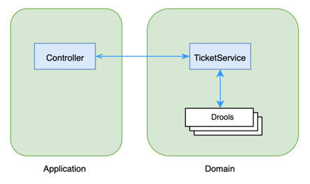

# Movie Tickets

## How to run

```bash
./gradlew bootRun
```

In another terminal:
```bash
curl -X POST -H "Content-Type: application/json" http://localhost:8080/costs -d "$(cat request.txt)" | jq
```

or if `jq` is not installed:
```bash
curl -X POST -H "Content-Type: application/json" http://localhost:8080/costs -d "$(cat request.txt)"
```

## Design

### Consideration

There are two possible ways to support flexible rules:
1. Rules Engine
2. Strategy Pattern

Rules Engine is ideal for scenarios where rules are complex and require flexible management and dynamic adjustments.
Strategy Pattern is suitable for scenarios where rules are simple and do not change frequently.

The requirement states that this application is intended to support decision-making around ticket pricing, which likely involves testing a variety of different rules, making it well-suited for a Rules Engine solution.

### System Design



[Drools](https://www.drools.org/) is used in this project as Rules Engine. `TicketService` simply forward request to Drools and generate response.

The rules can be easily edited or replaced. For example, by changing `ticketFareRule` in [application.properties](src/main/resources/application.properties) to "FlatPricing.drl", the application will be using another rule to calculate ticket costs.

## Assumptions

- Transaction ID in the response is set as the same as ID in the request. In the requirement document, the transaction ID is always 1, assuming that's a typo.
- In the request body, properties can be case-insensitive, e.g. `Age` or `aGE` are considered as the same as `age`.
- In `Customer` object, `name` can be ignored.
- In `Customer` object, `age` must > 0, otherwise that customer will be skipped.

## Further Improvements

- Rules can be saved and maintained in database.
- Expose an endpoint to process batch transactions.
- Expose an endpoint to read rules and apply on-the-fly.
- Currently, rule values are all static, can encapsulate within a fact object, so they can be changed dynamically.